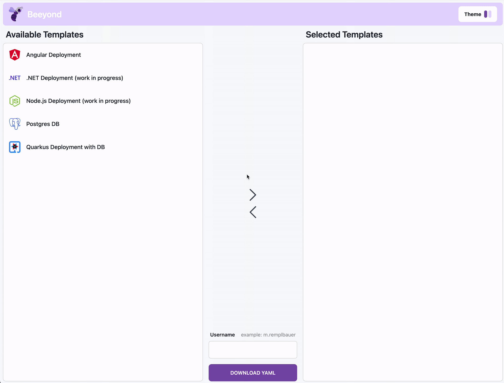

<!-- markdownlint-disable no-inline-html first-line-h1 -->


# Beeyond

Beeyond is a project aimed to provide user effortless access to Kubernetes. By utilizing manifest templates with wildcards, Beeyond enables users to create K8s manifest files with ease, allowing for efficient testing and deployment of their applications on Kubernetes.

## 🎬 Can I see it in action?

Sure! Below you see the process of generating a k8s manifest for an Angular application.

<p align="center">
  
</p>

## 📝 Template Format

The way Beeyond works is by utilizing manifest templates. These templates are used to generate the actual manifest files. The template documentation can be found [here](https://htl-leonding-project.github.io/leocloud-beeyond/template-docs.html).

## ⚓ Kubernetes Deployment

Beeyond is deployed in the LeoCloud and is accessible at:

- Frontend: https://student.cloud.htl-leonding.ac.at/m.remplbauer/beeyond
- Backend: https://student.cloud.htl-leonding.ac.at/m.remplbauer/beeyond-backend

## 🚀 Deploying Beeyond

### Deployment using Helm

When deploying using Helm, you need to update the `username` field in the `values.yaml` file of the helm chart to match your environment:

Now you can create the initial deployment using:

```sh
helm install leocloud-beeyond ./helm
```

To remove the deployment, run the following command:

```sh
helm uninstall leocloud-beeyond
```

### Deployment using Kubernetes manifests

When deploying using Kubernetes manifests, you need update some parts of the manifests to match your environment:

- you need to update the `path` field for the `ingress` of the `leocloud-beeyond-frontend` and `leocloud-beeyond-backend` deployment to match the `username` of the environment it should be deployed in following the format `/<username>/<deployment-name>(/|$)(.*)$`

- you need to update the `$BASE_PATH` and `$API_URL` environment variables in the `leocloud-beeyond-frontend` deployment to match the `username` of the environment it should be deployed in

With the updated manifests, you can deploy Beeyond using:

```sh
kubectl apply -f ./k8s-manifests
```

To remove the deployment, run the following command:

```sh
kubectl delete -f ./k8s-manifests
```
